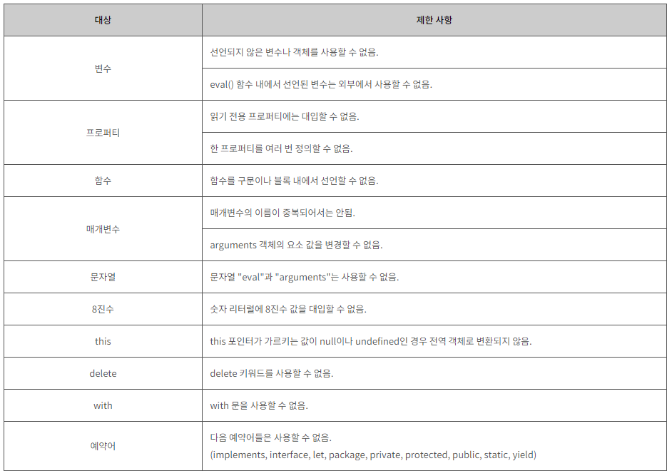

### 10번 문제

---

- Q10) 엄격 모드가 무엇인지에 대해 설명하라.
- A10)    
  엄격 모드(`Strict mode`)는 문법과 런타임 동작을 모두 검사하여, 실수를 에러로 변환하고, 변수 사용을 단순화(Simplifying) 시켜주는 모드이다.

---

### `Strict mode` 선언

- `Javascript` 스크립트의 시작 혹은 함수의 시작 부분에 "`use strict`"(또는 '`use strict`')를 선언하면 strict 모드로 코드를 작성 할 수 있다.

---

### `Javascript`에서 `strict` 선언

- #### ex )
  ```js
  "use strict";   
  var v = "Hi! I'm a strict mode script!";
  ```
### 함수에서 `strict` 선언

- #### ex )
  ```js
  function start(){   
  'use strict';   
      // 엄격 모드 시작!   
  }
  ```
---

### 엄격 모드(`Strict mode`)의 대표적인 특징

- 자바스크립트의 strict 모드는 기존 자바스크립트 언어의 일부 기능을 제한한 문법을 사용하며, 몇 가지 중요한 기능을 수정하여 강력한 오류 검사와 함께 향상된 보안 기능을 제공한다.



---
