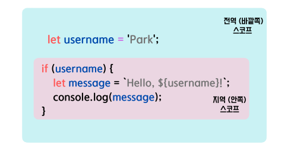

### 8번 문제

---

- Q8) 자바스크립트의 스코프와 호이스팅에 대해 설명하라.
- A8)    

  ### 스코프 (`scope`) `let`, `const`, `var`

  - 스코프(`scope`)이란,   
    참조 대상 식별자 (변수, 함수의 이름과 같이 다른 대상과 구분하여 식별할 수 있는 유일한 이름)를 찾아내기 위한 규칙이다.
    ---

    #### 스코프 (`scope`)의 구분

      

    - 전역 스코프(`Global scope`)   
      : 바깥 스코프 라고하며 어디에서든 참조 할 수 있다.
    - 지역 스코프(`Local scope`)   
      : 안쪽 스코프 라고하며 블록 안, 함수 내에서만 참조 할수있다.

    ---

  ### 호이스팅 (`hoisting`)

  - 호이스팅(`hoisting`)이란,   
    코드가 실행하기 전 변수선언/함수선언이 해당 스코프의 최상단으로 끌어 올려진 것 같은 현상을 말한다.

    ※ 변수/함수 선언문에서는 호이스팅이(`hoisting`)이 발생 되지만,   
       함수 표현식에서는 ***발생되지 않는다.***

    ### 함수 선언문 ex) 
    ```js
    introduce();
    
    function introduce() {
      console.log('저는 Goya Choi입니다');
    };   

    결과: "저는 Goya Choi입니다"
    ```

    ### 함수 표현식 ex)
    ```js
    introduce();
    
    var introduce = function () {
      console.log('저는 Goya Choi입니다');
    };   

    결과: TypeError
    ```
---
