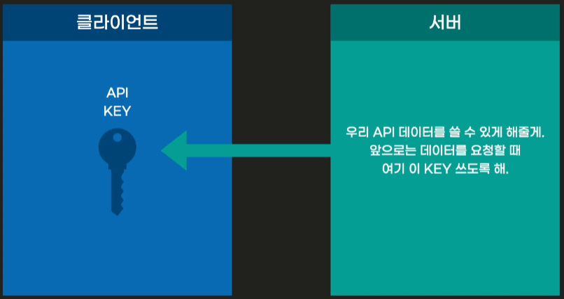

# API

### API란

    애플리케이션에서 데이터를 주고받기 위한 방법

    (데이터를 제공하는 쪽에서 방법을 규정하게 됨)

- 약자)  
  **A** pplication **P** rogramming **I** nterface

- **I** nterface)  
  데이터를 교환하기 위한 방법

### 1. API 사용법

- **_API는 데이터를 제공하는 쪽에서 정해놓은 규칙같은 것_**이기 때문에  
  그 데이터를 사용하고 싶은 사용자가 규칙에 따라 요청을 보내고, 요청을 받은 데이터 제공자가 요청이 자신이 정해놓은 규칙에 적합하다면요청받은 데이터를 요청자에게 되돌려 주는것..

### 2. 그 규칙은 어디에 있을까?

- API를 제공하는 쪽에서 API 문서를 별도로 만들어서 제공하는 것이 보편적이다.
- ex)  
  KAKAO에서 제공하는 API를 사용하고 싶다면 카카오에서 제공하는  
  [개발자들을 위한 페이지](https://developers.kakao.com/)에서상단에 메뉴에 문서를 클릭하면 관련된 정보들을 자세히 볼 수 있다. (NAVER도 동일함..)
- API 문서가 NAVER와 KAKAO처럼 친절하고 자세하게 방법까지 알려주는 경우도 있지만  
  그렇지 않은 경우도 있다. 일반적으로 대기업이 제공하는 API는 간단한 튜토리얼까지도 잘 제공이 되고, 작은 규모의 기업이나 개인이 제공하는 API를 사용하고자 할 때는 구글링같은 것이필요할 수도 있다.

### 3. 제공자는 어떻게 우리의 요청을 실시간으로 처리할 수 있을까?

### ○ 서버와 클라이언트의 개념

- 클라이언트  
  어떠한 정보나 서비스를 제공하고 받는 입장에서 지금 브라우저를 통해서  
  API 요청을 보낼 때 **_(클라이언트)_**
- 서버해당 요청을 받고 처리하는 쪽을 **_서버_** 라고 부름 **_(컴퓨터)_**  
  ※ 중요한점  
  : 서버는 정상적인 처리를 하기 위해선 항상 깨어있어야 함

  ### ex)

  만든 APP이 있다면 실행되는 시점은 페이지를 load 했을 때이다.  
  이때 사용자가 어떤 요청을 보낸다면 서버는 곧바로 응답을 해줘야  
  정상적으로 APP이 구동이 될 텐데, 클라이언트가 언제 요청을 보낼지 모르기 때문에  
  24시간 대기상태로 기다리고 있는것.  
    
    
  ※ 그렇다면 서버가 꺼지면 API를 못쓰나요?  
  네 못씁니다.

  ### ex)

  회원가입이 되어있다는 가정하에 로그인을 위해서 필요한 ID와 PW를 서버가 담당하고 있는것,  
  user가 입력창에 ID와 PW를 입력하고 엔터를 누르면 브라우저를 통해 내부적으로 요청을 보내게 됨.  
    
  그럼 서버가 이 요청을 확인하고 처리하는 역할을 하게 됨.  
    
  그렇기 때문에 서버가 꺼진다면 로그인을 할 수 없음..  
  

`API는 우리가 사용하려는 API의 규칙에 따라 요청을 보낸다면 API 서버에서는 올바른 요청이라면 원하는 데이터를 담아서 응답을 주고, 올바르지 않다면 보내주지 않음!!`

### 4. API KEY 란?

- 제공자가 누가 서버에 데이터를 사용하려 하는데 ID 처럼 식별하기 위해 할당해주는  
  API 서버와 사용자간에 약속된 비밀번호 같은 것.  
  

  ex) 카카오/ 네이버 등 같이 사용자가 많은 API서버에서 무료 데이터를 제공한다면  
  많은 사람들과 개발자들이 정보를 쓰고싶을 것이다.  
  그 많은 사람들이 엄청 많은 요청을 보내온다면 서버가 부담해야하는 것도 많고,  
  그 무엇보다 서버가 통제권을 잃을 것이다.  
  그래서 회원가입을 하고 `API KEY`를 발급받은 후 요청을 보낼 때 허가를 내어준  
  `API KEY`를 함께 보내라고 규칙을 정해줌.  
  
