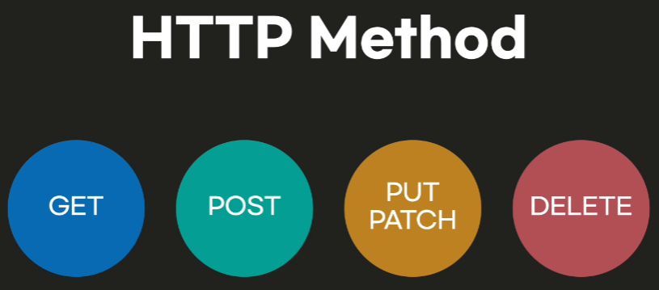
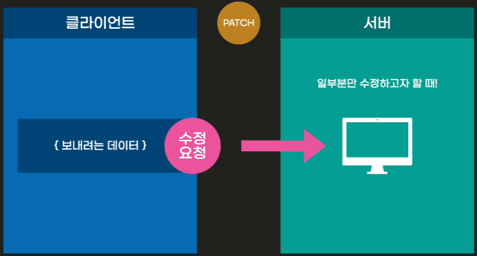
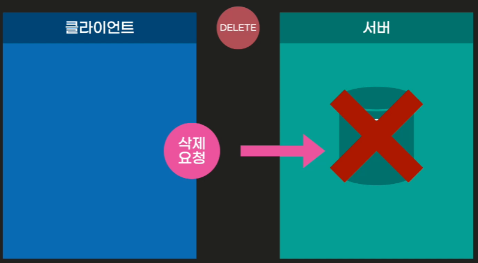

# HTTP

### HTTP란?

  
HTTP라는 것은 Protocol이다.  
우리가 서버랑 응답을 주고 받기위한 약속!

---

### HTTP Method란?

  
우리가 요청을 보낼 때 서버에게 **_어떤 동작을 요청할지_** 결정하는 도구이다!

---

### HTTP Method 종류

#### **_첫번째) GET_**

GET은 기본요청값인데 URL형식으로 서버에있는 데어터를 요청할 때,  
서버에 있는 데이터를 GET하고 싶을 때 사용함.

ex) fetch() 메소드를 사용할 때 기본적으로 GET요청이 들어가고 있었던 것.  

#### **_두번째) POST_**

POST는 클라이언트 쪽, 우리가 서버에 어떠한 데이터를 보내고 싶을 때 사용함.

- ex) 로그인할 때 ID와 PW를 입력하면 이 데이터가 유효한지 검사하기 위해서는  
   이 정보를 서버로 보낼 수 있어야함. 이럴 때 사용하는것이 POST!

#### **_세번째) PUT_**

PUT은 POST처럼 서버로 데이터를 제출한다는 자체는 동일하지만,  
POST는 생성 작업에 해당한다면,  
PUT 메소드는 기존의 정보를 수정하는, Update하는 역할에 해당 한다는차이점이 있다!

- ex) 만약 회원가입을 한다면 어떤 ID와 PW를 POST 해야됨.  
  그럼 서버에서 새롭게 user의 정보를 생성해준다.  
  그런데, user의 정보를 변경하고 싶다면 PUT메소드를 사용하면 된다!

#### **_세번째) PATCH_**

PATCH는 PUT처럼 수정을 담당하는 메소드이다! 하지만, 차이점은 PUT은 어떠한 정보 전체를 수정하는 메소드라면,  
PATCH는 일부분만 수정하고자 할 때 사용하는 것이다!

#### **_세번째) DELETE_**

DELETE는 이름처럼 무언가를 삭제하기 위한, 삭제를 요청하기 위한 메소드 이다!

